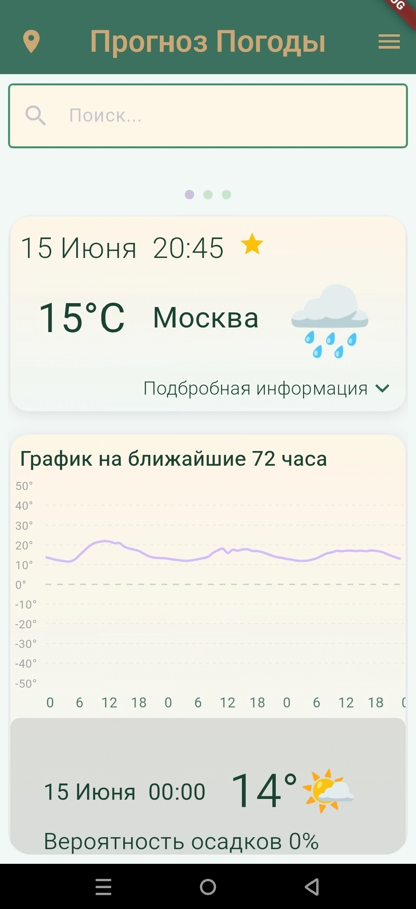
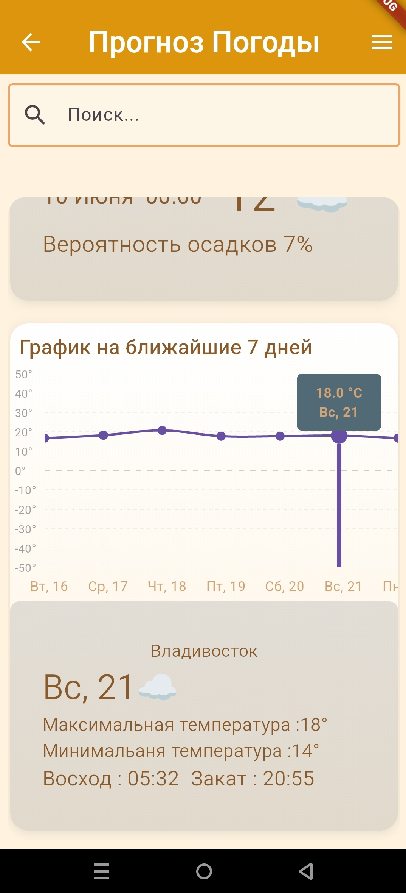
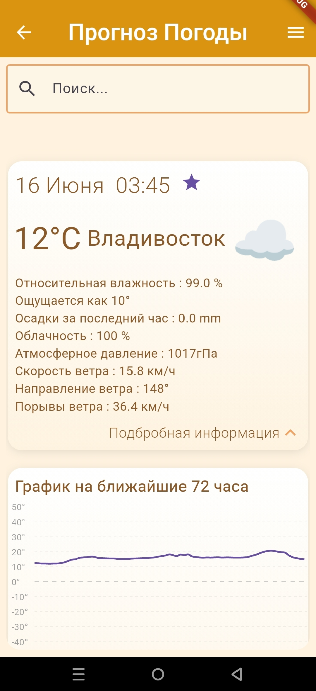
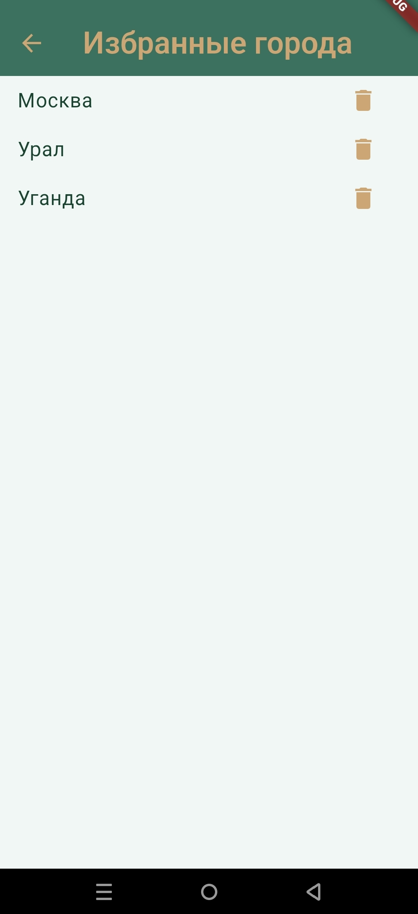
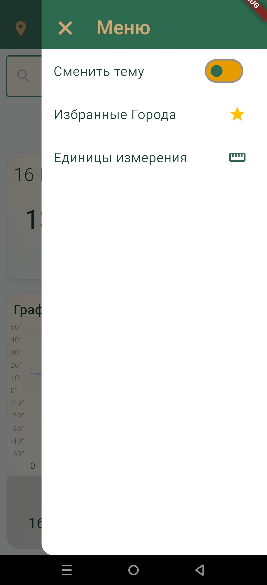

# 🌤 Forecast App — Прогноз погоды

[](https://flutter.dev)
[](https://bloclibrary.dev)


Приложение для получения прогноза погоды с определением местоположения, поиском городов и списком избранного.

##  Скриншоты

| Главный экран | 7-дневный прогноз | Детальный прогноз | Избранное | Меню |
|:---:|:---:|:---:|:---:|:---:|
|  |  |  |  |  |

##  Функционал

- Геолокация — автоматическое определение погоды
- Поиск по названию города
- Избранные города
- Светлая и тёмная тема
- Метрическая и имперская системы измерений
- Кэширование данных
- Графики температуры

## 🛠️ Стек технологий

| Компонент | Технология |
|-----------|------------|
| Язык | Dart ^3.11.5 |
| Фреймворк | Flutter |
| Управление состоянием | flutter_bloc ^9.1.1, provider ^6.1.5+1 |
| Навигация | go_router ^14.0.0 |
| Архитектура | Clean Architecture |
| HTTP клиент | dio ^5.9.2 |
| Геолокация | geolocator ^14.0.2 |
| Хранение | shared_preferences ^2.5.5, path_provider ^2.1.5 |
| Графики | fl_chart ^1.2.0 |
| Иконки | font_awesome_flutter ^11.0.0, cupertino_icons ^1.0.8 |
| Дата/время | intl ^0.19.0, flutter_native_timezone_2025 ^1.0.0 |
| Утилиты | equatable ^2.0.8, dartz ^0.10.1, get_it ^9.2.1 |
| Интернет | internet_connection_checker ^3.0.1 |
| Тестирование | bloc_test ^10.0.0, mockito ^5.4.0, build_runner ^2.4.6 |
| Линтинг | flutter_lints ^6.0.0 |

## Архитектура

Проект построен на Clean Architecture с разделением на слои:

- **Presentation** — UI и BLoC
- **Domain** — бизнес-логика и сущности
- **Data** — репозитории и источники данных

## ⚙️ Особенности работы

###  Доступ к API

Приложение использует внешние погодные API для получения актуальных данных. В связи с текущими сетевыми ограничениями на территории РФ, для стабильной работы приложения **необходимо подключение к VPN**.
 

##  Установка

```bash
git clone https://https://github.com/yayayayaressss-rgb/weather-forecast-for-the-week.git
cd forecast_app
flutter pub get
flutter run
```
##  Тестирование


```bash
# Генерация мок-объектов (обязательно перед запуском тестов)
flutter pub run build_runner build

# Запуск всех тестов
flutter test

# Очистка сгенерированных файлов
flutter pub run build_runner clean
```


